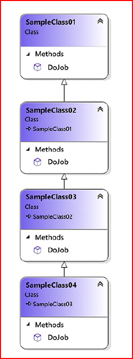
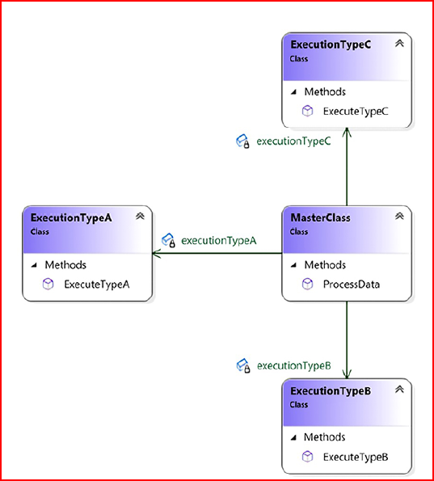
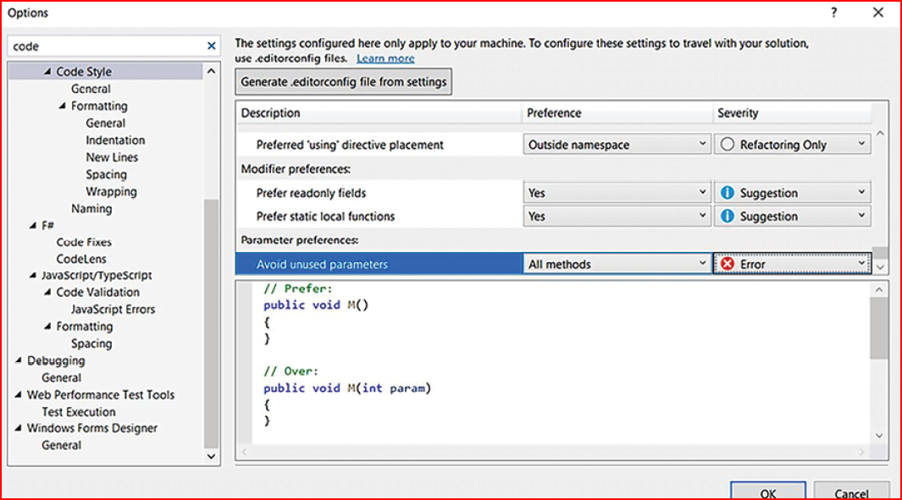
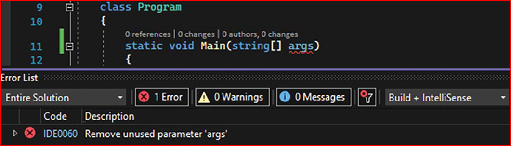
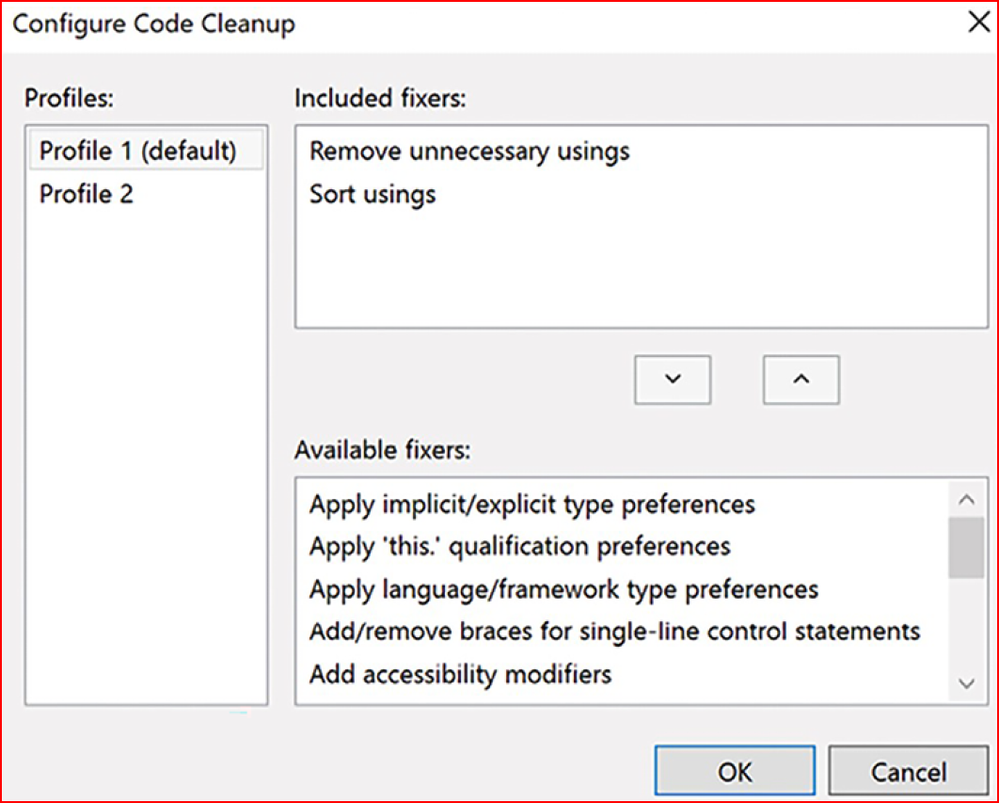
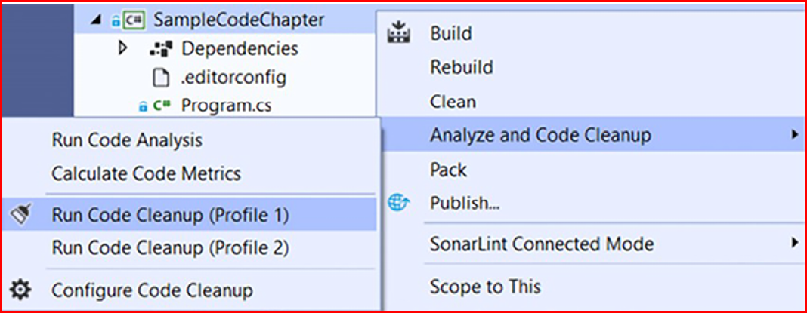
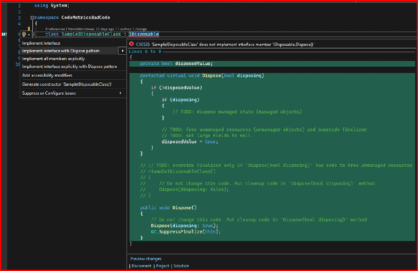

# Best Practises In Coding CSharp
This repo highlights best practices for creating safe, simple, and maintainable software, especially in C#. It views coding as both an art and a philosophy, and stresses the importance of using techniques and tools for code analysis to ensure high-quality development.

## Simplicity in coding
For a lot of folks, a top-notch programmer is the wizard who spins the most tangled web of code. But as the software world grows up, it's clear there's a whole new vibe. Complicated code? Nah, that's not the ticket to coding glory. It's actually a sign of shoddy work. A bunch of brainy scientists and whiz researchers back this up, stressing that ace code should be all about efficiency, top-notch quality, and keeping the budget in check.

Even when you've got a gnarly coding situation, clearing up the confusion and making your code process crystal clear is key. Give your methods and variables some good, meaningful names so your code practically explains itself. Stick to those SOLID principles (Single Responsibility, Open/Close, Liskov Substitution, Interface Segregation, and Dependency Inversion), and you’ll turn messy complexity into neat, simple code.

If you want to crank out good code, focus on making it easy to understand for anyone else who might look at it down the road. This tip will totally change your coding game. We’ll dig into each point of this chapter this way.

When you get that writing clean code means keeping it simple and clear, check out the Visual Studio tool called Code Metrics. It's a game-changer.


Once you have run the code metrics analysis, you will need to interpret each metric presented. The following subsections focus on describing how a maintainability index, cyclomatic complexity,depth of inheritance, class coupling, and the number of lines of code are useful in some real-life scenarios.

### Maintainability Index

The maintainability index is a score from 0 to 100 that measures how easy it is to maintain your code—the higher the score, the easier the maintenance. Good maintainability is crucial for software longevity, as changes are inevitable. To boost a low maintainability index, consider refactoring your code by ensuring classes and methods have a single responsibility, avoiding duplicate code, and keeping methods concise.
A commonly accepted value for the maintainability index is 85 or higher. Scores below this threshold may indicate that the code is becoming harder to maintain, while scores significantly lower (below 50) suggest the code is quite difficult to maintain and may require refactoring.

### Cyclomatic Complexity

Cyclomatic complexity measures the complexity of a software function based on the number of code paths (graph nodes). More paths mean higher complexity. It is commonly recommended a complexity score of less than 10 for each function is normally accepted. If a function exceeds this, refactoring is needed to break it into simpler methods. Common scenarios increasing complexity include loops within loops, many consecutive if-else statements, and a switch statement with extensive case processing in a single method.

Lets understand this through an example :

        /// <summary>
        /// This code is being used just for explaining the concept of
        /// cyclomatic complexity.
        /// It makes no sense at all. Please Calculate Code Metrics for
        /// understanding
        /// </summary>
        private static void CyclomaticComplexityExample()
        {
            var billingMode = GetBillingMode();
            var messageResponse = ProcessCreditCardMethod();
            switch (messageResponse)
            {
                case "A":
                    if (billingMode == "M1")
                        Console.WriteLine($"Billing Mode {billingMode} for " +
                        $"Message Response {messageResponse}");
                    else
                        Console.WriteLine($"Billing Mode {billingMode} for " +
                        $"Message Response {messageResponse}");
                    break;
                case "B":
                    if (billingMode == "M2")
                        Console.WriteLine($"Billing Mode {billingMode} for " +
                        $"Message Response {messageResponse}");
                    else
                        Console.WriteLine($"Billing Mode {billingMode} for " +
                        $"Message Response {messageResponse}");
                    break;
                case "C":
                    if (billingMode == "M3")
                        Console.WriteLine($"Billing Mode {billingMode} for " +
                        $"Message Response {messageResponse}");
                    else
                        Console.WriteLine($"Billing Mode {billingMode} for " +
                        $"Message Response {messageResponse}");
                    break;
                case "D":
                    if (billingMode == "M4")
                        Console.WriteLine($"Billing Mode {billingMode} for " +
                        $"Message Response {messageResponse}");
                    else
                        Console.WriteLine($"Billing Mode {billingMode} for " +
                        $"Message Response {messageResponse}");
                    break;
                default:
                    Console.WriteLine("The result of processing is unknown");
                    break;
            }
        }


If you calculate the code metrics of this code, you will find a bad result when it comes to cyclomatic complexity, as you can see in the following screenshot. A cyclomatic complexity number above 10 indicates that the code is difficult to read, and a developer will probably have trouble maintaining it in a future code change.

It is important to reinforce that the purpose of the code from this example is not the focus here. The point here is to show you the number of improvements that can be made to write better code :
The options from switch-case could be written using Enum.
- Each case processing can be done:
    - In a specific method.
    - In a specific class, inheriting the action from the superclass,using the polymorphism concept.
    - In a specific class, implementing an interface to define a contract.

switch-case can be substituted with Dictionary<Enum, Method> or by using the switch expression.

By refactoring this code with the preceding techniques, the result is a piece of code that is much easier to understand, as you can see in the following code snippet of its main method:
```markdown
```c#

         static void Main()
        {
         var billingMode = GetBillingMode();
         var messageResponse = ProcessCreditCardMethod();
         Dictionary<CreditCardProcessingResult, CheckResultMethod> methodsForCheckingResult = GetMethodsForCheckingResult();
         if (methodsForCheckingResult.ContainsKey(messageResponse))
             methodsForCheckingResult[messageResponse](billingMode,messageResponse);
         else
            Console.WriteLine("The result of processing is unknown");
        }
``` 
The key point here is that with the applied techniques, our understanding of the code increased and the complexity index decreased, thus proving the importance of cyclomatic complexity.

### Depth of inheritance

This metric represents the number of classes inherited by the one that is being analyzed. The more classes you have inherited, the worse the metric will be. This directly impacts the class coupling which eventually impacts the 
Open/Close principle stated by SOLID.



To reduce this metric, we can implement subsitute technique of composition or aggregation instead of inheritance.Lets understand it how we can do that following class coupling.

### Class Coupling

With the fact said above that inheritance might end in a tightly coupled code and changing a participant causes unintended consequences in others, thus resulting in bad maintenance of your code, resulting in bugs.By simply using the aggregation we can reduce the DOI metrics.



Once you  implemented aggregation as per above screenshot, you will see that the number of class coupling instances for the ProcessData() method, which calls ExecuteTypeA() , ExecuteTypeB() , and ExecuteTypeC() , equals three.

With composition/aggregation being a better practice  than inheritance, and since you will decouple code written from your class, the use of interfaces will solve class coupling problems.
In software development, high cohesion indicates that each class has its methods and data, with good relationships between them. Conversely, low coupling indicates that classes are not closely and directly connected.

### Number of lines of code

Understanding the number of lines of code (LOC) helps gauge software size and design but does not indicate complexity. More than 1,000 LOC in a single class suggests poor design, and having too many methods violates the Single Responsibility Principle of SOLID. Visual Studio 2022 differentiates between lines of source code (including blanks) and lines of executable code. As a software architect, you should provide best practices to programmers to enhance their coding techniques and understand the impact of poor metrics. Using these metrics and a version control system distinguishes amateur from professional development.

### Understanding and applying tools that can evaluate C# code
One of the issues that you (as a software architect) need to deal with
is the coding style of the team. This certainly results in a better understanding of the code. For instance, if you go to the Visual Studio Menu, then Tools -> Options, and then, in the left-hand menu, Text Editor -> C#, you will find ways to deal with different code style patterns, and a bad coding style is even indicated as an error in the Code Style options, as follows:



The preceding screenshot chnage that Avoid unused parameters was considered an error.After this change, the result of the compilation of the code presented at the beginning of the chapter is different, as you can see
in the following screenshot:



You can export your coding style configuration and attach it to your project so that it will follow the rules you have defined.Another good tool that Visual Studio 2022 provides is Analyze and Code Cleanup. With this tool, you can set up some code standards that can clean up your code. For instance, in the following screenshot, it was set to remove unnecessary code:



The way to run Code Cleanup is by selecting it with the help of a right-click in the Solution Explorer area, over the project where you want to run it. After that, this process will run in all the code files
you have:



There are many other great extensions that can improve the productivity and quality of your code and solutions. Search for them in this nuget manager like SonarAnalyzer.CSharp NuGet package, SonarLint etc.

### common practices to ensure safe code in C#.
-try-catch
There are a lot of cases where an application crashes, and the reason for that is the lack of using try-catch.Conversely, bad try-catch usage can cause damage to your code too,especially because you will not see the correct behavior of that code and may misunderstand the results provided.

The following code shows an example of an empty try-catch
statement:
```markdown
```c#
private static int CodeWithEmptyTryCatch(string textToConvert)
{
try
{
return Convert.ToInt32(textToConvert);
}
catch
{
return default;
}
}
```
try-catch statements must be connected to logging solutions so that you can have a response from the system that will indicate the correct behavior and, at the same time, not cause application crashes. The following code shows an ideal try-catch statement with logging management. It is worth mentioning that specific exceptions should be caught whenever possible, since catching a general exception will hide unexpected exceptions:
```markdown
```c#
private static int CodeWithCorrectTryCatch(string textToConvert)
{
try
{
return Convert.ToInt32(textToConvert);
}
catch (FormatException err)
{
Logger.GenerateLog(err);
return 0;
}
}
```
It is very important to note that exceptions are, computationally speaking, expensive. No matter whether you are throwing them to indicate an error or catching them to manage errors, it takes a lot of computational processing. So, it is common, and preferable, to rely on a higher-level exception handler instead of trying to handle everything everywhere, as the code might become hard to reason about, particularly if there is not a good action to take when an
exception happens. That means you may not handle the exceptions in every method, especially if you do not know what to do with them at that part of the code and you will throw it again to a higher-level handle. You should prioritize handling exceptions where meaningful actions can be taken.

However, it is also worth mentioning that exception errors delivered to the end user can cause the feeling that bad software was delivered.So its imperative to take a mindful decision to what to show or not to end users.

### try-finally and using

Memory leaks can be considered one of the worst software behaviors. They cause instability, bad usage of computer resources, and undesired application crashes. C# tries to solve this with GarbageCollector, which automatically releases objects from memory as soon as it realizes an object can be freed.

Objects that interact with I/O are the ones that generally are not managed by Garbage Collector: the filesystem, sockets, and so on. The following code is an example of the incorrect usage of a FileStream object because it thinks Garbage Collector will release the memory used, but it will not:
```markdown
```c#
private static void CodeWithIncorrectFileStreamManagement()
{
FileStream file = new ("C:\\file.txt", FileMode.CreateNew);
byte[] data = GetFileData();
file.Write(data, 0, data.Length);
}
```
Besides, it takes a while for Garbage Collector to interact with objects that need to be released, and sometimes, you may want to do it yourself. For both cases, the use of try-finally or using statements
is the best practice:

```markdown
```c#

private static void CorrectFileStreamManagementFirstOption()
{
FileStream file = new ("C:\\file.txt",FileMode.CreateNew);
try
{
byte[] data = GetFileData();
file.Write(data, 0, data.Length);
}
finally
{
file.Dispose();
}
}

private static void CorrectFileStreamManagementSecondOption()
{
using (FileStream file = new ("C:\\file.txt", FileMode.CreateNew))
{
byte[] data = GetFileData();
file.Write(data, 0, data.Length);
}
}

private static void CorrectFileStreamManagementThirdOption()
{
using FileStream file = new ("C:\\file.txt", FileMode.CreateNew);
byte[] data = GetFileData();
file.Write(data, 0, data.Length);
}
```
The preceding code shows exactly how to deal with objects that are not managed by Garbage Collector. Both try-finally and using are implemented. As a software architect, you do need to pay attention to this kind of code. The lack of try-finally or using statements can cause huge damage to software behavior when it is running. It is worth mentioning that using code analysis tools, such as Sonar Lint and Code Analysis, will automatically alert you to these sorts of problems.

### The IDisposable interface

In the same way that you will have trouble if you do not manage objects created inside a method with try-finally /using statements, objects created in a class that does not properly implement the IDisposable interface may cause memory leaks in your application. For this reason, when you have a class that deals with and creates objects, you should implement the Disposable pattern to guarantee the release of all resources created by the class:



### Some common coding tricks to remember

- Classes, methods, and variables should have understandable names
- Methods should not have high complexity levels
- Members must have the correct visibility
- Duplicate code should be avoided
- Objects should be checked before usage
- Constants and enumerators should be used
- Unsafe code should be avoided
- try-catch statements cannot be empty
- Dispose of the objects that you have created, if they are disposable
- At least public methods should be commented
- switch-case statements must have a default treatment


