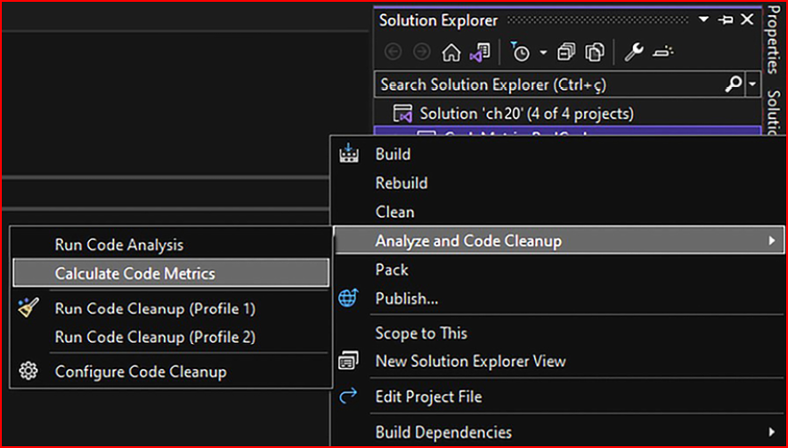
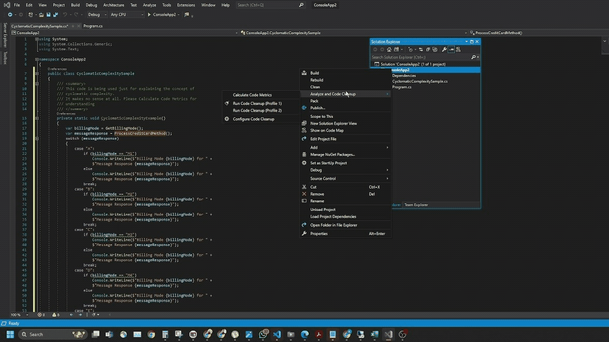

# Best Practises In Coding CSharp
This repo highlights best practices for creating safe, simple, and maintainable software, especially in C#. It views coding as both an art and a philosophy, and stresses the importance of using techniques and tools for code analysis to ensure high-quality development.

## Simplicity in coding
For a lot of folks, a top-notch programmer is the wizard who spins the most tangled web of code. But as the software world grows up, it's clear there's a whole new vibe. Complicated code? Nah, that's not the ticket to coding glory. It's actually a sign of shoddy work. A bunch of brainy scientists and whiz researchers back this up, stressing that ace code should be all about efficiency, top-notch quality, and keeping the budget in check.

Even when you've got a gnarly coding situation, clearing up the confusion and making your code process crystal clear is key. Give your methods and variables some good, meaningful names so your code practically explains itself. Stick to those SOLID principles (Single Responsibility, Open/Close, Liskov Substitution, Interface Segregation, and Dependency Inversion), and you’ll turn messy complexity into neat, simple code.

If you want to crank out good code, focus on making it easy to understand for anyone else who might look at it down the road. This tip will totally change your coding game. We’ll dig into each point of this chapter this way.

When you get that writing clean code means keeping it simple and clear, check out the Visual Studio tool called Code Metrics. It's a game-changer.

Once you have run the code metrics analysis, you will need to interpret each metric presented. The following subsections focus on describing how a maintainability index, cyclomatic complexity,depth of inheritance, class coupling, and the number of lines of code are useful in some real-life scenarios.

### Maintainability Index

The maintainability index is a score from 0 to 100 that measures how easy it is to maintain your code—the higher the score, the easier the maintenance. Good maintainability is crucial for software longevity, as changes are inevitable. To boost a low maintainability index, consider refactoring your code by ensuring classes and methods have a single responsibility, avoiding duplicate code, and keeping methods concise.
A commonly accepted value for the maintainability index is 85 or higher. Scores below this threshold may indicate that the code is becoming harder to maintain, while scores significantly lower (below 50) suggest the code is quite difficult to maintain and may require refactoring.

### Cyclomatic Complexity

Cyclomatic complexity measures the complexity of a software function based on the number of code paths (graph nodes). More paths mean higher complexity. It is commonly recommended a complexity score of less than 10 for each function is normally accepted. If a function exceeds this, refactoring is needed to break it into simpler methods. Common scenarios increasing complexity include loops within loops, many consecutive if-else statements, and a switch statement with extensive case processing in a single method.

Lets understand this through an example :

        /// 

        /// This code is being used just for explaining the concept of
        /// cyclomatic complexity.
        /// It makes no sense at all. Please Calculate Code Metrics for
        /// understanding
        /// 

        private static void CyclomaticComplexityExample()
        {
            var billingMode = GetBillingMode();
            var messageResponse = ProcessCreditCardMethod();
            switch (messageResponse)
            {
                case "A":
                    if (billingMode == "M1")
                        Console.WriteLine($"Billing Mode {billingMode} for " +
                        $"Message Response {messageResponse}");
                    else
                        Console.WriteLine($"Billing Mode {billingMode} for " +
                        $"Message Response {messageResponse}");
                    break;
                case "B":
                    if (billingMode == "M2")
                        Console.WriteLine($"Billing Mode {billingMode} for " +
                        $"Message Response {messageResponse}");
                    else
                        Console.WriteLine($"Billing Mode {billingMode} for " +
                        $"Message Response {messageResponse}");
                    break;
                case "C":
                    if (billingMode == "M3")
                        Console.WriteLine($"Billing Mode {billingMode} for " +
                        $"Message Response {messageResponse}");
                    else
                        Console.WriteLine($"Billing Mode {billingMode} for " +
                        $"Message Response {messageResponse}");
                    break;
                case "D":
                    if (billingMode == "M4")
                        Console.WriteLine($"Billing Mode {billingMode} for " +
                        $"Message Response {messageResponse}");
                    else
                        Console.WriteLine($"Billing Mode {billingMode} for " +
                        $"Message Response {messageResponse}");
                    break;
                default:
                    Console.WriteLine("The result of processing is unknown");
                    break;
            }
        }

